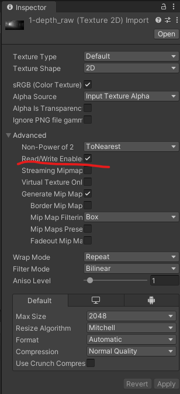
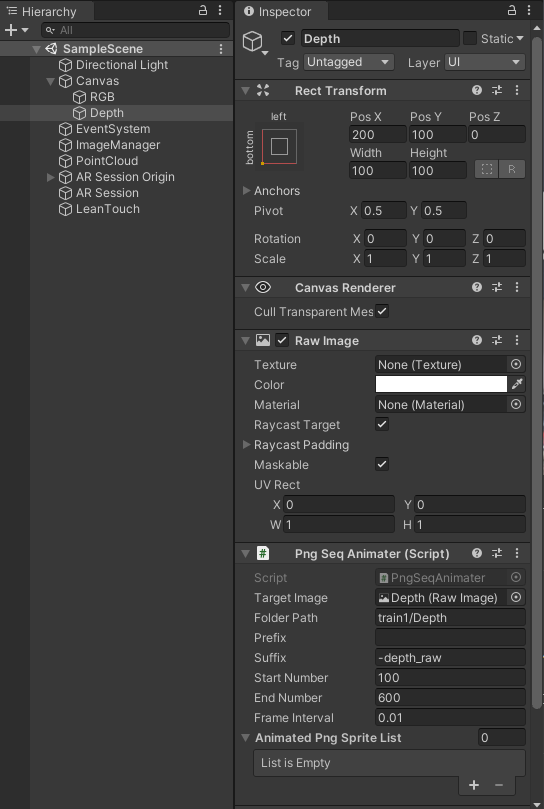

# 3D volumetric video viewer for AR
This is 3D volmetric video viewer project for AR by using depth images created by machine learning.
|VR|AR|
| ---- | ---- |
|||


## How to Use
### Comfirmed version
- [x] Unity: 2020.3.17f1
- [x] ARFoundation: 4.1.7
- [x] ARCore XR Plugin: 4.1.7

### Preparation
For this project, I use ["Learning to Recover 3D Scene Shape from a Single Image"](https://github.com/aim-uofa/AdelaiDepth/tree/main/LeReS) to get depth images from a monocular RGB video.  
1. You should compress the video for the acceralation.  
```ffmpeg -i yourvideo.mp4 -vf scale=640:-1 yourvideo_out.mp4```  
2. Convert your video to sequential images to load the machine leaning pipeline.  
```ffmpeg -i yourviedeo_out.mp4 -vcodec png dir/%d.png ```

3. To obtain depth images from monocular RGB images, please see README in repo of ["Learning to Recover 3D Scene Shape from a Single Image"](https://github.com/aim-uofa/AdelaiDepth/tree/main/LeReS)

### Instaration
**This part is about on this Unity project.**  
1. Import your depth images obtained by above process to `Assets/Resource/yourdir/Depth`. Also import your RGB images to `Assets/Resources/yourdir/RGB`.

2. You should check *Read/Write Enabled* in inspector of all of your image imported.  


3. At PngSeqAnimater of `Canvas/RGB` and `Canvas/Depth` in the Hierarchy, you should change the parameters.   


4. If you want to chance point size, you can see `Assets/PointCloud` in this project.

5. Play it! Deploy it!  


